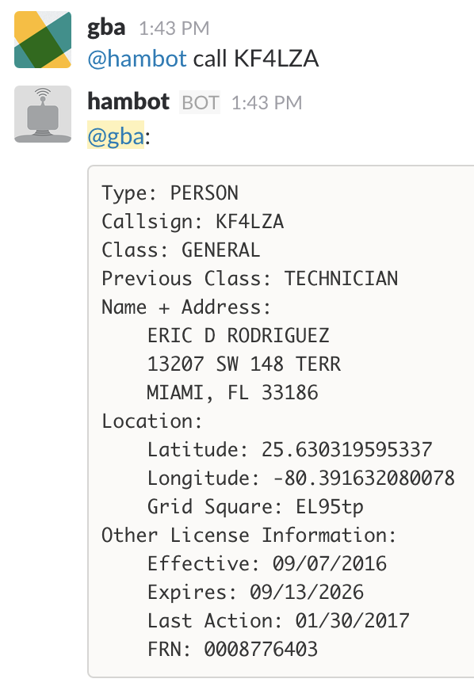

HamBot - Slack Amateur (Ham) Radio Bot.
***************************************

HamBot is a Bot for Slack focused on Amateur Radio use-cases. Currently HamBot
supports one command, which is callsign lookup:

Usage
=====

You'll need a Slack API Token, which can be generated/retrieved as follows:

1) Go to the Slack Web interface.
2) Select Apps.
3) Select Build.
4) Select Custom.
5) Select Bots.
6) Name your bot whatever you'd like.
7) Copy the API Token.

Run the bot::

    export SLACKBOT_API_TOKEN='xoxb-XXXX-XXXX'
    hambot

Installation
============

You'll need to create a Slack Bot and create a Slack Bot API Token, then::

    pip install hambot

Source
======
Github: https://github.com/ampledata/hambot

Author
======
Greg Albrecht W2GMD <oss@undef.net>

http://ampledata.org/

Copyright
=========
Copyright 2017 Greg Albrecht

License
=======
Apache License, Version 2.0. See LICENSE for details.
